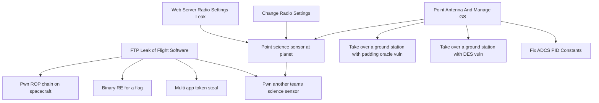

# solvers

Mission Control's Solvers for the Finals game. The solver's descriptions can be found in the individual solver folders.

## Challenge dependency graph

```mermaid
graph TD
    C1[Point Antenna And Manage GS]
    C2[Change Radio Settings]
    C3[Web Server Radio Settings Leak]
    C4[FTP Leak of Flight Software]
    C5[Fix ADCS PID Constants]
    C6[Take over a ground station with DES vuln]
    C7[Take over a ground station with padding oracle vuln ]
    C8[Point science sensor at planet]
    C9[Pwn another teams science sensor]
    C10[Multi app token steal]
    C11[Binary RE for  a flag]
    C12[Pwn ROP chain on spacecraft]
    C1 --> C5
    C1 --> C6
    C1 --> C7
    C1 --> C8
    C2 --> C8
    C3 --> C8
    C8 --> C9
    C4 --> C9
    C4 --> C10
    C4 --> C11
    C4 --> C12
```
