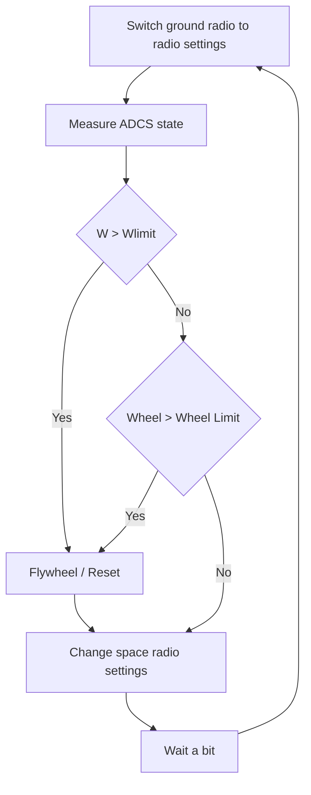

# The attack

During finals several attacks occurred during the game that targeted the attitude determination and control system.

These attacks were highly effective for two reasons

- They have the ability to effect multiple SLA categories
- Unmitigated these attacks can crash the flight software 

# Mitigation strategies

## Detect bad angular velocities 

The IMU and wheel measurements in the ADCS target are sufficient to determine if your satellite is over spun. Use this telemetry to your advantage:

During a contact create a simple loop to determine if your satellite is over spun. If you detect a bad condition:
- Set your ADCS in to flywheel mode.
- Reset your ADCS with known constants.

This protects against bad commands from your team and bad commands from other teams

## Detect bad PID settings.

The ADCS housekeeping packet contains information about the PID gains for all the controllers. 

While in contact create a simple loop to determine if your satellite has weird PID values. If so set your satellite to flywheel mode. Then reset with known parameters.

# Avoidance Strategies 

## Radio 

The strategies discussed in [radio rotation](./radio_rotation.md) are sufficient to prevent these attacks

# Flow chart

A working strategy to avoid/mitigate all attacks against the ADCS might look like this.

