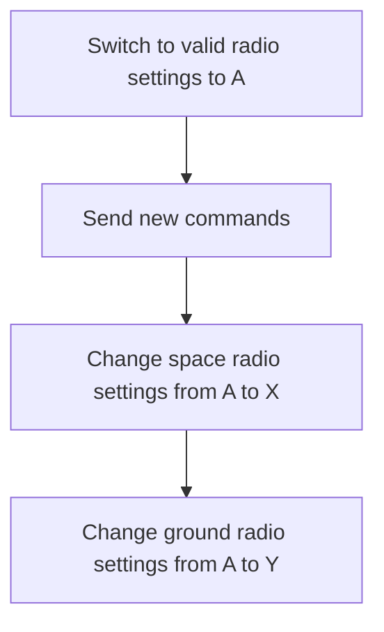

# Radio rotation strategy 

# The attack

Radio settings for every ground station were leaked as part of the web server challenge. If you were interested in attacking another teams satellites you could continually scrape this data in order to find the radio setting of all ground stations and then send rogue messages to someone elses satellite. The settings are leaked at a specific rate

# Avoidance

## Keep your default settings secret

When your satellite goes in to safe mode or when you reset it loads the default radio settings. That means its very important to protect your default radio settings.

The only way to do this is to limit your use of default settings to when you first start using them and then always use other settings

## Rotate your space radio settings 

The most effective way to avoid attacks via your radio is to realize that the ground radio settings are released at a specific rate. With that in mind you can always avoid someone detecting your space radio settings by making sure to change your space radio settings after every command. If you change your space radio settings and then wait to change your ground radio settings until the moment you need to use it no one will be able to exploit the groundstation leak against you

## Leave your ground radios with bad settings

You could get a team to waste a lot of time by leaving your ground stations with settings that "look good" but are not actually valid.

# Flow chart 

A strategy that encompasses all of these approaches might look like this.

As long as this entire strategy is executed within the update period of the ground station leak you will be undetectable.
