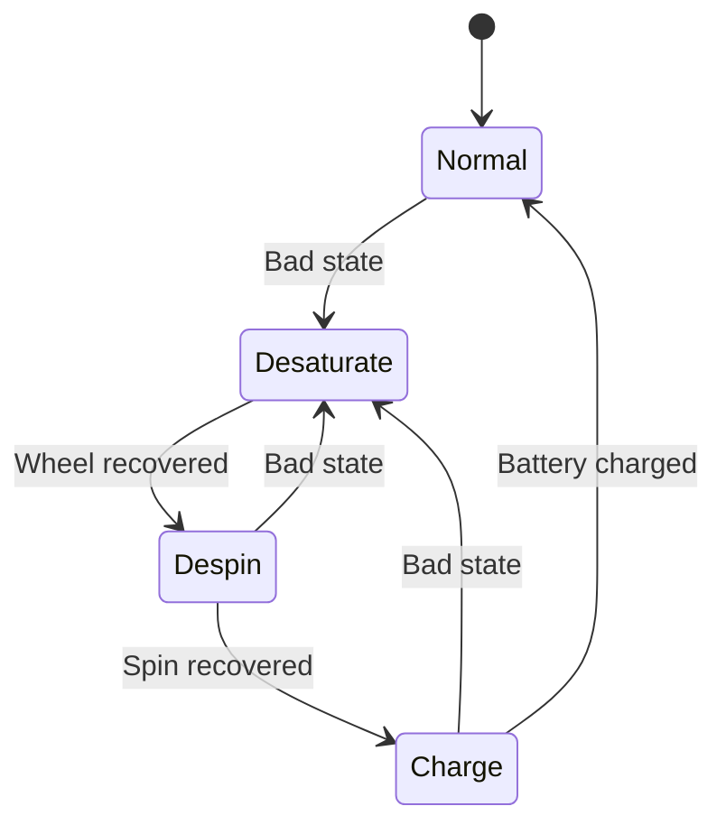

# Safemode

The spacecraft contains an app that will attempt to keep the satellite in working order if it is neglected or being poorly managed.

## State diagram

## "Bad State" Conditions

The following table outlines the conditions on which state travesal occurs
- **Trigger conditions** describe when a state is "bad"
- **Recovered  conditions** describe when a state is no longer "bad"

When entering a state the spacecraft will stay in that state until the necessary recovery conditions are met to exit.

| Value            | Trigger | Recovered  |
| ---------------  | ----------- | -----------  |
| Wheel total angular velocity (rad/s) | 450 | 150 |
| Spacecraft total angular velocity (rad/s) | 0.2 | 0.05 | 
| Battery charge  (percent) | 0.15 | 0.30 |
| Time since last SAFE PING message (seconds) | 70 minutes | --- | 

The ping is sent by the operators to the satellite. If the satellite is being operated correctly, but does not receive a ping within the time specified above, the spacecraft *will enter safemode*. Ensure that pings are sent to the spacecraft in a timely and consistent manner.

## Entering a safe state

When the spacecraft leaves `Normal` state and enters a safe state

- The spacecraft radio receiver is turned off.
- Some devices are turned off

## Resuming normal operations

When the spacecraft reenters `Normal` state 

- The radio settings are reset to defaults
- The radio receiver is turned on
- The ping timer is reset
