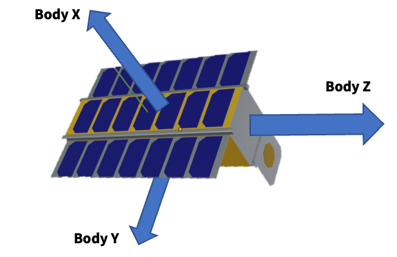

This document outlines the specifications for the satellite 

The satellites devices and parameters have been picked favoring playability of the game over realism. 

For example the game would not be very interesting if it took 30 minutes to turn the satellite. Therefore the reaction wheels and magneto-torquers are extremely oversized

# Devices 
## Reaction Wheels 
| Wheel Number |  Axis | Base Power Draw | Max Momentum | 
| ---------    | ------|  -----------    | ------------ | 
| 1 | [1.0, 0.0, 0.0] | 10.0 | 50.0 |
| 2 | [0.0, 1.0, 0.0] | 10.0 | 50.0 |
| 3 | [0.0, 0.0, 1.0] | 10.0 | 50.0 |

## Sun Sensors

| Axis | Field of view (deg) |
| ---- | ------------------- | 
 | [1.0, 0.0, 0.0] | 75.0
 | [0.0, 1.0, 0.0] | 75.0
 | [0.0, 0.0, 1.0] | 75.0
 | [-1.0, 0.0, 0.0] | 75.0
 | [0.0, -1.0, 0.0] | 75.0
 | [0.0, 0.0, -1.0] | 75.0
 | [0.7071, 0.7071, 0.0] | 75.0
 | [-0.7071, 0.7071, 0.0] | 75.0
 | [-0.7071, -0.7071, 0.0] | 75.0
 | [0.7071, -0.7071, 0.0] | 75.0
 | [0.7071, 0.0, 0.7071] | 75.0
 | [-0.7071, 0.0, 0.7071] | 75.0
 | [-0.7071, 0.0, -0.7071] | 75.0
 | [0.7071, 0.0, -0.7071] | 75.0
 | [0.0, 0.7071, 0.7071] | 75.0
 | [0.0, -0.7071, 0.7071] | 75.0
 | [0.0, -0.7071, -0.7071] | 75.0
 | [0.0, 0.7071, -0.7071] | 75.0

The entire bank of sun sensors draws: {}
## Magnetic Torquer
| Axis | Max Dipole | 
| ---- | ---------- |
| [1.0, 0.0, 0.0] | 8000.0 | 
| [0.0, 1.0, 0.0] | 8000.0 | 
| [0.0, 0.0, 1.0] | 8000.0 | 

## Radio 

| Antenna half angle (deg) | Axis | Transmitter Power | Receiver Power Draw |
| ---------------------    | ---- | ------------------| --------------------| 
| 180.0 | [1.0, 0.0, 0.0] | 50.0 | 50.0 | 

## Other Devices

| Device | Power Draw | 
| ------ | ---------- | 
| GPS    |  10.0 |
| Star Tracker  | 20.0 |
| Magnetic Field Sensor | 3.0|
| IMU  | 10.0 |

## Battery

Battery has a capacity of 2920000

# Physical Parameters 

## Inertia
The satellite has the following inertia matrix

|   |  X  | Y | Z |
| --- | ---- | ---- | --- | 
| X |  200.0  | 0.0 | 0.0 |
| Y |  0.0  | 200.0 | 0.0 |
| Z |  0.0  | 0.0 | 200.0 | 

## Mass

The mass of the satellite is 100.0

## Solar Panels

The spacecraft has only one solar panel mounted which faces the spacecraft body's x axis as shown in the picture above

The solar panel has the following specifications.
| Panel Number |  Axis | Area (m^2) | Efficiency (%) | 
| ------------ | ----- | ---------- | -------------- | 
|   1   |   [1.0, 0.0, 0.0]   |   2.0   |   0.2   |

## Telescope

The spacecraft has only one telescope whose boresight is along the spacecraft body's z axis.

The telescope has the following specifications.
|  X  |  Y  |  Z  | Accuracy Degrees (half angle) |
| --- | --- | --- | ---------------- | 
|  0  |  0  |  1  |    7.5 degrees   |